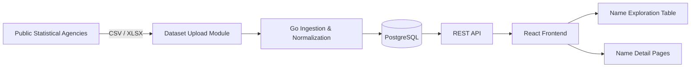

# Affirm Name

_Data-grounded name exploration for people who need their name to reflect who they are._

> Affirm Name helps trans and nonbinary people (and anyone else) discover names that fit their culture, gender expression, and legal realities by combining official datasets into one search and analysis experience.

---

## At a Glance

| Item | Summary |
| --- | --- |
| **Purpose** | Make name selection easier, safer, and better informed for transgender and nonbinary people. |
| **Coverage** | Multiple countries, decades of official records, and the spectrum between “mostly female” and “mostly male.” |
| **Key Surfaces** | Name Exploration Table, Name Detail Pages, dataset upload + ingestion flow. |
| **Data Method** | Government-published datasets (SSA, ONS, SCB, etc.) normalized into a shared schema with spectrum-based gender scoring. |
| **Stack** | Go + PostgreSQL backend, TypeScript/React frontend, manual dataset upload module. |

---

## Quick Project Status

**✅ DONE (Phase 1 - MVP)**
- [x] Frontend setup (React 19 + TypeScript + Vite)
- [x] Year range, countries, gender balance filters
- [x] Sortable names table with pagination
- [x] English/Russian i18n support
- [x] URL state synchronization
- [x] Performance optimizations for slow backend
- [x] Mock and real API modes

**🚧 TODO (Frontend)**
- [ ] Re-enable popularity filters (when backend <500ms)
- [ ] Re-enable name search (when backend implements glob patterns)
- [ ] Name Detail Page - interactive trend chart
- [ ] Main Landing Page - hero section
- [ ] Loading skeletons
- [ ] Mobile responsiveness polish
- [ ] Accessibility improvements
- [ ] Export results (CSV/JSON)
- [ ] Dark mode

---

## Why the Project Exists

In many countries, name changes are constrained by gendered policy, cultural norms, or bureaucratic expectations. To avoid administrative pushback, trans people often need names that:

- **feel right** emotionally and culturally,
- **match their identity** across languages and borders,
- **appear frequently enough** to be accepted without scrutiny, and
- **do not require a simultaneous gender-marker change**.

Affirm Name provides historical, data-backed context so people can evaluate:

- gender distribution as a spectrum rather than a binary,
- how names drift toward or away from a gender over time,
- which names are unisex or close to it,
- how popular a name is overall and by country, and
- where the name is currently in use.

This is a tool for affirmation, safety, and clarity.

---

## What You Can Do

| Feature | What it Delivers |
| --- | --- |
| **Name Exploration Table** | Powerful filtering (year, country, gender spectrum, popularity), sorting (popularity, total count, balance, countries, alphabet), presence periods, per-country breakdowns, optional row tinting. |
| **Name Detail Pages** | Historical gender trends, popularity shifts per decade, country-level stats, male/female counts, and the same filters mirrored from the table view. |
| **Dataset Upload Module** | A manual workflow to add new official datasets so the catalogue keeps expanding while maintaining accuracy. |

### Filters & Metrics at a Glance

| Dimension | Example Controls | Insight |
| --- | --- | --- |
| **Time** | Year range, earliest/latest usage | Spot modern vs. historical names. |
| **Place** | Country checkboxes and flag indicators | Focus on relevant jurisdictions. |
| **Gender Balance** | 0–100 spectrum slider | Find unisex or near-unisex names quickly. |
| **Popularity** | Rank, percentile, minimum total count, “top N” | Ensure the name is common enough to avoid scrutiny. |

---

## Data Foundations

- **Public Datasets:** SSA (US), ONS (UK), SCB (Sweden), and other statistical agencies provide the raw numbers. Files are downloaded manually to preserve provenance.
- **Unified Schema:** Every dataset is normalized so names from different countries can be compared side by side.
- **Gender Spectrum:** 0 = fully female usage, 100 = fully male; most names fall somewhere in between.
- **Popularity Metric:** Driven by absolute occurrences, enabling precision queries like “top 95% of names” or “at least 500 recorded people.”

---

## How the System Fits Together

---

## Intended Use Cases

- Trans people choosing a new name, including those who need gender-neutral or cross-gender-usable options.
- People seeking names from their culture, language, or region while shifting gender associations.
- Queer and nonbinary folks exploring unisex naming possibilities.
- Researchers studying gender shifts, naming trends, or cultural patterns.
- Anyone curious about the history, popularity, and global presence of given names.

---

## Tech Stack & Modules

| Component | Role |
| --- | --- |
| **Go + PostgreSQL backend** | Dataset ingestion, parsing, normalization, and REST API delivery. |
| **TypeScript / React frontend** | Interactive tables, filters, charts, and detail views. |
| **Dataset upload workflow** | Human-reviewed import of government datasets for accuracy. |

---

## Long-Term Vision

Affirm Name is evolving toward a comprehensive international resource that offers:

- gender-neutral and culturally grounded name exploration,
- cross-language equivalence and canonical groupings,
- multilingual UI and search,
- personalized, privacy-preserving recommendations, and
- guidance for navigating bureaucratic processes safely.

The mission stays constant: empower people—especially trans and nonbinary users—to choose names that affirm who they are while navigating real-world systems.
